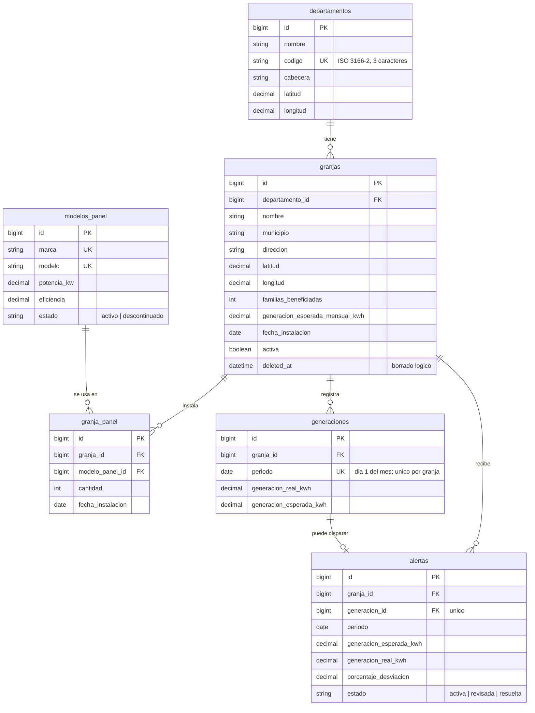

# Sistema de Registro y Monitoreo de Generación Solar por Departamento

Aplicación web para registrar granjas solares de Guatemala, su generación mensual real y esperada, y
analizar el resultado por departamento: indicadores nacionales, mapa interactivo, alertas de bajo
desempeño y proyección de generación futura.

Competencia de Programación con IA, 11 y 12 de septiembre de 2026.

- **URL pública:** [generacion-solar-production-gtqero.laravel.cloud](https://generacion-solar-production-gtqero.laravel.cloud)
- **Repositorio:** [github.com/Nehemiasp/generacion-solar](https://github.com/Nehemiasp/generacion-solar)
- **Panel de administración:** `/admin`
- **Documentación de la API:** `/docs/api` (interactiva) y [docs/API.md](docs/API.md)
- **Uso de IA durante el desarrollo:** [docs/USO-DE-IA.md](docs/USO-DE-IA.md)
- **Sistema de diseño:** [docs/DISENO.md](docs/DISENO.md)
- **Presentación:** [docs/presentacion/](docs/presentacion/) (11 diapositivas con notas del orador)
- **Manual de usuario:** [docs/MANUAL-DE-USUARIO.md](docs/MANUAL-DE-USUARIO.md) · [PDF](docs/MANUAL-DE-USUARIO.pdf)
- **Diagrama de base de datos:** [sección Modelo de datos](#modelo-de-datos) · [PDF](docs/DIAGRAMA-BD.pdf)
- **Prompts utilizados:** [docs/PROMPTS.md](docs/PROMPTS.md)

## Objetivos

**General:** dar a una entidad de energía un solo lugar donde registrar las granjas solares del país y
saber, por departamento, cuánto generan, cuánto deberían generar y dónde están fallando.

**Específicos:**

1. Registrar granjas, sus paneles y su generación mensual con validación de datos (RF-01 a RF-07,
   RF-17).
2. Calcular sin almacenar la capacidad instalada, la generación acumulada y el CO₂ evitado, para que
   nunca queden desincronizados (RF-08 a RF-10).
3. Mostrar el estado del país en un tablero, un mapa interactivo y un reporte por departamento con
   filtro de fechas (RF-11 a RF-13).
4. Detectar automáticamente las granjas cuya generación real cae al 80 % de la esperada o menos y
   dejar rastro del seguimiento (RF-14).
5. Proyectar la generación de los próximos meses de cada granja y mostrar cuánto ha acertado el
   modelo (RF-15).
6. Exponer todo por una API REST versionada y documentada (RF-16).

## Manual de usuario resumido

La versión completa, con una sección por pantalla, está en
[docs/MANUAL-DE-USUARIO.md](docs/MANUAL-DE-USUARIO.md).

| Quiero… | Dónde |
|---|---|
| Ver el estado nacional de un vistazo | Tablero (`/`): gráfica de 12 meses, cinco indicadores, mapa, alertas y tabla por departamento |
| Ubicar las granjas y filtrarlas | Mapa (`/mapa`): marcadores por capacidad, color por generación, anillo rojo si hay alerta; casillas por departamento |
| Comparar departamentos en un rango de fechas | Reporte (`/reporte`): elegir Desde y Hasta, Aplicar; las columnas son ordenables |
| Ver qué granjas están fallando | Alertas (`/alertas`): pestañas Activas, Revisadas, Resueltas, Todas |
| Ver el detalle y la proyección de una granja | Clic en el nombre desde cualquier tabla o desde el mapa |
| Dar de alta una granja y sus paneles | `/admin` → Granjas → Crear granja; luego, en su ficha, Crear panel |
| Registrar la generación de un mes | `/admin` → Generaciones → Crear generación; la esperada se precarga; si la real queda al 80 % o menos, la alerta se crea sola |
| Dar seguimiento a una alerta | `/admin` → Alertas → Cambiar estado (Activa → Revisada → Resuelta) |
| Consumir los datos desde otro sistema | `/docs/api` (interactiva) o [docs/API.md](docs/API.md) |

## Stack

| Pieza | Elección |
|---|---|
| Backend | Laravel 13, PHP 8.4 |
| Panel administrativo | Filament 5 |
| Base de datos | MySQL 8.4 en producción (Laravel Cloud), SQLite en local |
| Frontend público | Blade y Tailwind CSS 4, fuera de Filament |
| Mapa | Leaflet con tiles grises de Esri, sin API key |
| Gráficas | Chart.js |
| Documentación de API | Scramble (OpenAPI generado desde los controladores) |

El tablero público, el mapa, el reporte y la ficha de granja son vistas Blade propias. Filament se usa
solo para el CRUD interno.

## Requisitos

- PHP 8.3 o superior con las extensiones `pdo_mysql`, `pdo_pgsql` o `pdo_sqlite`, `mbstring`, `intl`, `curl`, `zip`, `gd`
- Composer 2
- Node.js 20 o superior

## Instalación local

```bash
git clone https://github.com/Nehemiasp/generacion-solar.git
cd generacion-solar
composer install
npm install
cp .env.example .env
php artisan key:generate
touch database/database.sqlite
php artisan migrate:fresh --seed
npm run build
php artisan serve
```

La aplicación queda en `http://127.0.0.1:8000`. Para desarrollo con recarga en caliente, `npm run dev`
en otra terminal.

### Credenciales del panel

| Correo | Contraseña |
|---|---|
| `admin@solar.gt` | `password` |

Se crean con el seeder y se pueden cambiar con `ADMIN_EMAIL` y `ADMIN_PASSWORD` en el `.env`.

### Usar MySQL o PostgreSQL en local

```env
DB_CONNECTION=mysql   # o pgsql
DB_HOST=127.0.0.1
DB_PORT=3306          # 5432 en PostgreSQL
DB_DATABASE=generacion_solar
DB_USERNAME=postgres
DB_PASSWORD=secreto
```

## Comandos propios

```bash
php artisan solar:evaluar-alertas
```

Recorre todas las generaciones registradas y reconstruye las alertas. Se usa después de una carga
masiva de datos, porque las inserciones en bloque no disparan el observador de modelo.

## Reglas de negocio

Viven en [config/solar.php](config/solar.php) y no están escritas a mano en ningún otro archivo.

| Constante | Valor | Significado |
|---|---|---|
| `factor_co2_kg_por_kwh` | 0.40 | Kilogramos de CO₂ evitados por kWh generado |
| `umbral_alerta` | 0.80 | Se genera alerta si la generación real es igual o menor a este porcentaje de la esperada |
| `meses_historicos_proyeccion` | 12 | Períodos que alimentan la regresión |
| `min_periodos_regresion` | 3 | Con menos períodos se usa promedio en lugar de recta |

## Modelo de datos



Versión imprimible: [docs/DIAGRAMA-BD.pdf](docs/DIAGRAMA-BD.pdf).

- `granjas` usa borrado lógico y una bandera `activa`: una granja se desactiva, nunca se borra.
- `generaciones` guarda el período como el día 1 del mes y tiene índice único por granja y período.
- `alertas` tiene índice único por generación, así que una generación produce como máximo una alerta.

**Valores derivados, calculados y nunca almacenados:**

| Valor | Cómo se obtiene |
|---|---|
| Capacidad instalada kW | Suma de `cantidad × potencia_kw` de los paneles de la granja |
| Generación acumulada kWh | Suma de `generacion_real_kwh` de sus períodos |
| CO₂ evitado kg | Generación acumulada × 0.40 |
| Porcentaje de desviación | `(real − esperada) / esperada × 100` |

Guardarlos como columnas introduciría riesgo de desincronización cada vez que cambian los paneles de
una granja. El scope `Granja::conMetricas()` los resuelve con subconsultas, así que listar 35 granjas
con sus métricas cuesta una sola consulta.

## Alertas

Un observador sobre `Generacion` evalúa cada guardado: si la generación real es igual o menor al 80%
de la esperada, crea o actualiza la alerta; si deja de cumplirse, la elimina. El caso borde del 80%
exacto sí genera alerta, porque el requisito pide alertar cuando la generación está "al menos 20% por
debajo". Hay pruebas para 79%, 80% y 81% en `tests/Feature/AlertaTest.php`.

## Proyección

Regresión lineal por mínimos cuadrados sobre los últimos 12 períodos registrados. El detalle del
método y su justificación están en [docs/API.md](docs/API.md#proyección) y en la ficha de cada granja,
que muestra además la precisión histórica del modelo: qué habría proyectado con los datos previos de
cada mes y el error contra el valor real.

## Pruebas

```bash
php artisan test
```

17 pruebas cubren el umbral de alertas, la proyección (serie lineal, serie plana, pocos períodos, piso
en cero, ventana configurable), las pantallas públicas, los endpoints de la API, los códigos 404 y 422
y la suficiencia de los datos de demostración.

## Despliegue

Ver [docs/DESPLIEGUE.md](docs/DESPLIEGUE.md).

## Estructura

```
app/
  Enums/                 Estados de panel y de alerta
  Filament/              Recursos y widgets del panel interno
  Http/Controllers/      PublicoController y Api/V1
  Http/Resources/        API Resources
  Models/                Departamento, ModeloPanel, Granja, GranjaPanel, Generacion, Alerta
  Observers/             GeneracionObserver (dispara la evaluación de alertas)
  Services/              AlertaService, EstadisticasService, ProyeccionService
  Support/Formato.php    Formato de cifras y unidades
database/seeders/        DepartamentoSeeder (los 22 reales) y DemoSeeder
docs/                    Diseño, API, despliegue, uso de IA
resources/views/publico/ Tablero, mapa, reporte, alertas y ficha de granja
```
